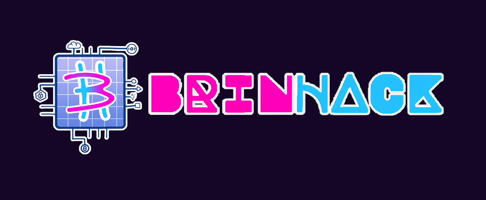

# BrinHack 2025 - Official Website



## 🚀 About

BrinHack 2025 is a premier hackathon featuring innovative tracks including IoT, CyberSecurity, Blockchain, Sustainability, and Open Innovation. This repository contains the source code for its official website.

## ✨ Features

- **Interactive Cloud-Based UI**: Unique, immersive interface with animated clouds representing hackathon tracks
- **Dynamic Timeline**: Visual representation of the hackathon schedule with animated elements
- **Sponsor Showcase**: City skyline visualization representing different tiers of sponsorship
- **Fully Responsive**: Optimized for all devices from mobile to desktop
- **Accessibility Focused**: Designed with inclusivity in mind

## 🛠️ Built With

- [Next.js 15](https://nextjs.org/) - React framework for production
- [Tailwind CSS](https://tailwindcss.com/) - For responsive styling
- [Framer Motion](https://www.framer.com/motion/) - For smooth animations
- [TypeScript](https://www.typescriptlang.org/) - Type safety and developer experience

## 📱 Mobile Optimization

The site is fully responsive with special optimizations for mobile devices:

- Adaptive cloud layouts for different screen sizes
- Simplified animations on low-power devices
- Touch-friendly navigation
- Responsive typography and spacing

## 🚀 Getting Started

First, clone the repository:

```bash
git clone https://github.com/AskitEndo/BrinHack2025-site
cd BrinHack2025-site
```

Then, install dependencies:

```bash
npm install
# or
yarn install
# or
pnpm install
```

Finally, run the development server:

```bash
npm run dev
# or
yarn dev
# or
pnpm dev
```

Open [http://localhost:3000](http://localhost:3000) with your browser to see the result.

## 📋 Project Structure

- `/app` - Next.js app directory structure
- `/components` - Reusable React components
  - `HeroSection.tsx` - Landing page hero section
  - `TrackSection.tsx` - Hackathon tracks with cloud visualization
  - `TimelineSection.tsx` - Event timeline display
  - `SponsorSection.tsx` - Sponsor showcase with building visualization
- `/public` - Static assets including images and icons

---

Developed with ❤️ for BrinHack 2025 by [AskitEndo](https://github.com/AskitEndo/)
